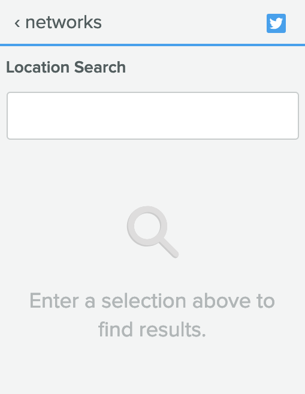

import { Head } from 'mdx-deck'

export { default as theme } from './theme'
import { Link, List } from './styledComponents'

<Head>
  <title>Alt Text</title>
</Head>

# Alt Text

---

## What is Alt Text?

<List>
	<li>Text alternatives for non-text content (images, icons, emojis, images of text) that can be programmatically determined</li>
	<li>A short description of an image</li>
	<li>Alt text is read by a screen reader when it reaches an image to allow the content to be perceived</li>
	<li>Alt text using the <code>alt</code> tag is for images</li>
</List>

---

## Non-text content


---

## Why Alt Text?

<blockquote>Guideline 1.1 - Text Alternatives: Provide text alternatives for any non-text content so that it can be changed into other forms people need, such as large print, braille, speech, symbols or simpler language.</blockquote>
<Link href="https://www.w3.org/TR/WCAG20/#text-equiv"><cite>WCAG 2.0 Guidelines</cite></Link>

---

## Do I need to add alt text content to every image?

Nope.

---

## Do I need to supply an alt attribute to every image?

Yes.

---

## What happens if I don't supply an alt attribute to an image?

Bad things.

The image url might be read instead or just "Image".

---

## Empty/null alt text

Use empty/null alt text for decorative images.

<code>alt=""</code> allows the screen reader to skip over the image.

---

## What is a decorative image?

An image that doesn’t convey any meaning or add information. If the page makes sense without the image, it is probably decorative.

---

## What about Aria-hidden?

We know we can use <code>aria-hidden="true"</code> to hide things from screen readers, so can we use it for images?

No, because it is not semantically correct. Use <code>aria-hidden</code> for icons and other elements you want to hide for screen reader users.

---

## What does not go in alt text?

<List>
	<li>Redundant information that is already on the page</li>
	<li>“Picture of”, “Image of”... (Screen readers already announce this)</li>
	<li>Information that should be accessible to everyone, such as a caption</li>
</List>

---
## Examples from the app - Inbox First Use


---

## App Examples - Inbox First Use code

```
<h1>Effortlessly Manage Your Social Inbox</h1>

```

---

## App Examples - Tagging empty state

Does this need alt text?



---

## How descriptive should alt text be?

Alt text should be a short and consise description of the image that includes the context.
A picture is worth a thousand words, but alt text should not be that long at all.

---

## Does alt text need to be localized / translated?

Yes. It is part of the content on the page.

---

## Help! I don't know what to do!

When in doubt, consult your designer or PM.

---

## Some Helpful Resources
<List>
	<li><Link href="https://webaim.org/techniques/alttext/">WebAIM</Link></li>
	<li><Link href="https://accessibility.oregonstate.edu/alttext">Oregon State</Link></li>
	<li><Link href="https://www.deque.com/blog/great-alt-text-introduction/">Deque</Link></li>
	<li><Link href="https://www.w3.org/WAI/tutorials/images/informative/">W3 examples</Link></li>
</List>